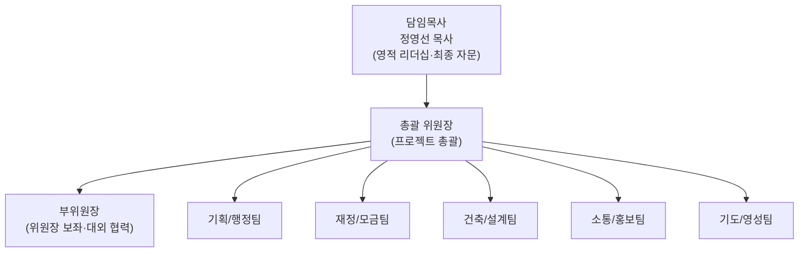
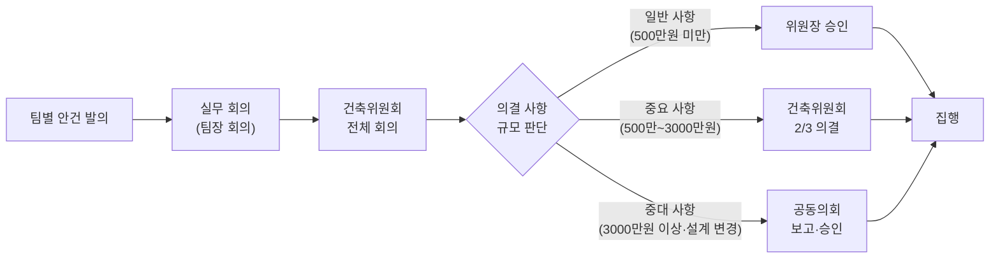

# 제곡교회 성전 건축 준비 계획서

> **"산골의 작은 교회, 세상을 품는 큰 성전을 세우다"**
>
> 주후 2025년 · 제곡교회 건축위원회

---

## I. 프로젝트 개요

### 1. 건축의 배경 및 필요성

제곡교회는 1983년 강원도 홍천군 남면 제곡리 274-5에 설립된 이래, 41년간 산골 마을의 등불이 되어왔습니다. 2013년 정영선 목사 부임 이후 12년간의 헌신적 목회를 통해, 평균 연령 70대·20여 명이던 교회는 **다문화·다세대가 함께 예배하는 건강한 공동체**로 성장했습니다.

그러나 이러한 성장 이면에 **심각한 공간적·법적 문제**가 존재합니다:

| 구분 | 현황 |
|------|------|
| **건물 노후화** | 35년 전 조립식 판넬로 건축, 구조적 안전 우려 |
| **불법 증축** | 식당(20여 평), 현관, 화장실, 유아실이 도로 점유 상태 |
| **위험 구조물** | 컨테이너 위 십자가 종탑이 한쪽으로 기울어지는 중 |
| **양성화 불가** | 대지의 80% 초과 건축물로 합법화 불가능 |
| **연간 벌금** | 홍천군으로부터 매년 150만 원 이상의 벌금 부과 |
| **주차 문제** | 주차장 부재로 도로에 20여 대 불법 주차 |
| **사택 문제** | 집주인이 사택과 뒷 논을 매매로 내놓아 긴급 매입 필요 발생 |

> [!CAUTION]
> 현재 교회 건물은 불법 건축물로 분류되어 매년 벌금이 부과되고 있으며, 종탑의 구조적 안전 문제는 즉각적인 대응이 필요한 상황입니다.

### 2. 제곡교회 성전 건축의 비전과 핵심 가치

#### 비전 선언문 (Vision Statement)

> **"지역과 열방을 품는 산골의 작은 천국, 제곡교회"**

#### 핵심 가치 (Core Values)

1. **합법적이고 안전한 예배 공간** — 자유롭고 안전하게 합법적으로 예배드릴 수 있는 성전
2. **다음 세대를 세우는 공간** — 아이들이 뛰놀고 말씀으로 훈련받는 교육 환경
3. **다문화 공동체의 열린 공간** — 영어·러시아어 동시통역이 가능한 다국적 예배 공간
4. **지역 사회 섬김의 거점** — 9인 소규모 요양원, 지역 교회 네트워크 허브
5. **농어촌 교회의 희망 모델** — 자립과 선교를 실현하는 산골 교회의 롤 모델
6. **성도 참여형 건축** — 조립식 판넬 건축을 통한 성도 직접 참여와 비용 절감

### 3. 프로젝트 기본 개요

| 항목 | 내용 |
|------|------|
| **사업명** | 제곡교회 신축 성전 건축 프로젝트 |
| **건축 위치** | 현 사택 뒤 매입 부지 (논 → 대지 전환 후 건축) |
| **건축 방식** | 조립식 판넬 건축 (성도 참여형) |
| **예상 규모** | 본당 약 60~80평, 부속 시설 포함 총 100~120평 (추후 설계 확정) |
| **예상 총 소요 기간** | 약 24~30개월 (준비 12개월 + 설계/인허가 6개월 + 시공 6~12개월) |
| **주차 계획** | 부지 내 20대 이상 주차 가능한 주차장 확보 |

---

## II. 현황 및 타당성 분석

### 1. 현재 교회의 공간적 한계 및 문제점

#### (1) 물리적 한계

- **본당**: 35년 전 1대 목회자가 건축한 샌드위치 판넬 구조로, 단열·방음·방수 성능이 극도로 저하됨
- **식당**: 3대 목사 시절 불법 증축된 20여 평으로 도로를 점유 중
- **화장실/유아실**: 도로 위에 불법 건축되어 양성화 불가능
- **종탑**: 컨테이너 위에 설치된 십자가 종탑이 기울어지고 있어 안전 위협
- **주차장**: 전무하여 도로에 20여 대 불법 주차, 교통 민원 발생 우려

#### (2) 법적 문제

- 대지 대비 건폐율 80% 초과로 **건축법 위반** 상태
- 도로 점유 건축물로 **도로법 위반** 상태
- 홍천군으로부터 **연간 150만 원 이상 벌금** 지속 부과
- 불법 건축물 양성화 방안이 없어 **근본적 해결책은 신축뿐**

#### (3) 사역적 한계

- 증가하는 교인 수(특히 젊은 가정·어린이)에 비해 공간 부족
- 다문화 사역(동시통역 예배)을 위한 전용 공간 부재
- 어린이부 분리 운영 공간 협소
- 성경 통독, 제자훈련 등 교육 프로그램 운영 공간 부족
- 9인 요양원 운영을 위한 별도 공간 확보 불가

### 2. 건축 부지에 대한 법적·환경적 검토

#### 매입 부지 현황

| 항목 | 내용 |
|------|------|
| **위치** | 현 사택 뒤편 부지 (논) |
| **매입 경위** | 사택 집주인이 사택과 뒤편 논을 매매로 내놓아, 교인들과 기도 후 융자를 통해 매입 |
| **현재 지목** | 논 (답) → 대지 전환 필요 |
| **융자 상환** | 은행 융자 상환 진행 중, 교인들이 대지 매입 헌금으로 동참 중 |

#### 사전 검토 필요 사항

- [ ] 농지전용 허가 신청 (논 → 대지)
- [ ] 지목 변경 절차 (답 → 대)
- [ ] 건축 허가 사전 심의 (홍천군 건축과)
- [ ] 지질·지반 조사
- [ ] 우수·오수 처리 계획 수립
- [ ] 접도 조건 및 진입로 확보 방안
- [ ] 건폐율·용적률 검토 (관리지역 기준)
- [ ] 환경영향평가 해당 여부 확인

### 3. 교인 수 추이 및 미래 성장 예측

#### 교인 수 변화 (2013~2025)

| 연도 | 주요 사건 | 예상 출석 교인 수 |
|------|-----------|------------------|
| 2013 | 정영선 목사 부임 | 약 20명 |
| 2014~2016 | 제자훈련, 기도학교 실시 | 약 25~30명 |
| 2017~2018 | 교회 정비, 전도 본격화 | 약 30~40명 |
| 2019 | 젊은 가정 유입 시작 | 약 40~50명 |
| 2020~2021 | 코로나, 가정예배 훈련 | 약 45~55명 |
| 2022~2023 | 다문화 성도 증가, 선교사 파송 | 약 55~65명 |
| 2024~2025 | 지속 성장, 건축 준비 | 약 60~70명 |

> **12년간 세례 교인 37명**, 다문화 성도 지속 유입, 귀촌 가정 등록 증가 추세

#### 미래 성장 예측 (건축 후)

- **단기 (1~2년)**: 합법적 공간 확보로 기존 교인 안정 정착 → **약 80~90명**
- **중기 (3~5년)**: 요양원 사역, 지역 교회 네트워크 확대 → **약 100~120명**
- **장기 (5~10년)**: 다문화 선교 허브, 다음 세대 성장 → **약 120~150명**

> [!NOTE]
> 신축 성전은 현재 교인 수 대비 **약 1.5~2배 수용 규모**로 설계하여, 향후 5~10년 성장을 수용할 수 있도록 계획합니다.

---

## III. 조직 및 운영 계획

### 1. 건축위원회 조직도 및 각 팀별 역할 (R&R)

#### 각 팀별 역할 (R&R)

| 팀 | 팀장 자격 | 주요 역할 | 인원 |
|----|-----------|-----------|------|
| **총괄 위원장** | 장로 또는 원로 집사 | 프로젝트 전체 일정·예산 조율, 최종 의사결정, 대외 대표 | 1명 |
| **부위원장** | 안수집사 이상 | 위원장 보좌, 외부 기관·교단 협력 창구 | 1명 |
| **기획/행정팀** | 행정 경험자 | 건축 인허가·법률 검토, 행정 서류, 전체 일정 관리, 회의록 작성, 자료 아카이빙 | 3~4명 |
| **재정/모금팀** | 회계·재정 경험자 | 예산 편성·집행 관리, 투명한 회계 보고, 모금 캠페인 기획·실행, 외부 감사 대응 | 3~4명 |
| **건축/설계팀** | 건축·기술 이해자 | 설계사무소·시공사 선정, 공사 현장 감독, 자재 검토, 조립식 판넬 시공 관리 | 3~5명 |
| **소통/홍보팀** | 미디어 활용 가능자 | 주보·홈페이지·SNS 진행 상황 공유, 모금 홍보물(영상·브로슈어) 제작, 비전 레터 발송 | 2~3명 |
| **기도/영성팀** | 기도 사역 경험자 | 릴레이 금식 기도회, 비전 공유 예배, 건축 중 영적 돌봄, 갈등 예방·중재 | 2~3명 |

> [!TIP]
> 제곡교회의 다문화 특성을 반영하여, 각 팀에 **외국인 성도 1명 이상**을 포함시키면 다양한 관점을 확보하고 공동체 통합에 기여할 수 있습니다.

### 2. 의사결정 프로세스 및 갈등 조정 매뉴얼

#### 의사결정 단계

#### 갈등 조정 매뉴얼

| 단계 | 방법 | 담당 |
|------|------|------|
| **1단계: 경청** | 갈등 당사자의 의견을 충분히 경청 | 해당 팀장 |
| **2단계: 중재** | 양측 의견 수렴 후 조정안 제시 | 위원장·부위원장 |
| **3단계: 기도** | 기도/영성팀 주관 합심 기도 | 기도/영성팀 |
| **4단계: 의결** | 건축위원회 표결 (과반수) | 전체 위원 |
| **5단계: 목회적 돌봄** | 담임목사의 영적 상담과 회복 | 담임목사 |

### 3. 정기 회의 및 보고 체계

| 회의 유형 | 주기 | 참석 대상 | 주요 내용 |
|-----------|------|-----------|-----------|
| **팀별 실무 회의** | 주 1회 | 각 팀원 | 주간 업무 진행 상황, 이슈 논의 |
| **팀장 회의** | 격주 1회 | 위원장, 부위원장, 각 팀장 | 팀 간 조율, 일정 점검, 예산 확인 |
| **건축위원회 전체 회의** | 월 1회 | 전체 위원 | 월간 진행 보고, 주요 안건 의결 |
| **공동의회 보고** | 분기 1회 | 전체 교인 | 진행 상황·재정 현황 투명 보고 |
| **비전 보고 예배** | 반기 1회 | 전체 교인 + 후원자 | 건축 비전 공유, 기도 요청, 후원 감사 |

> 모든 회의록은 기획/행정팀이 작성하여 **Google Drive** 등 클라우드에 아카이빙하고, 교인 누구나 열람 가능하도록 공개합니다.

---

## IV. 공간 기획 및 설계 방향

### 1. 층별·공간별 활용 계획

제곡교회의 사역 특성과 미래 비전을 반영한 공간 구성안입니다.

#### 1층 — 예배·친교 공간

| 공간 | 예상 면적 | 용도 |
|------|-----------|------|
| **예배실 (본당)** | 약 40~50평 | 주일예배, 특별예배, 찬양예배 (약 100~120석) |
| **강대상 구역** | 약 5평 | 설교단, 찬양팀 공간, 동시통역 부스 (영어·러시아어) |
| **친교실/식당** | 약 20~25평 | 주일 점심 식사, 소그룹 모임, 지역 행사 공간 |
| **주방** | 약 5~7평 | 식사 준비, 한방차·냉커피 준비 |
| **화장실** | 약 3~4평 | 남녀 분리, 장애인 화장실 1개 포함 |
| **현관/로비** | 약 5평 | 안내 데스크, 신발장, 게시판, 방문자 환영 공간 |

#### 2층 또는 별동 — 교육·사역 공간

| 공간 | 예상 면적 | 용도 |
|------|-----------|------|
| **어린이부실** | 약 10~15평 | 어린이 예배, 성경 통독, 영어 성경 캠프 |
| **다목적 교육실** | 약 10~15평 | 제자훈련, 세계관 학교, 묵상 훈련, 소그룹 |
| **목사실/상담실** | 약 5평 | 목회 상담, 행정 업무 |
| **창고/기계실** | 약 3~5평 | 비품 보관, 기계 설비 |

#### 외부 공간

| 공간 | 용도 |
|------|------|
| **주차장** | 20대 이상 수용 (기존 도로 불법 주차 해소) |
| **마당/놀이터** | 어린이 놀이 공간, 야외 행사, 바자회 개최 장소 |
| **조경 구역** | 들꽃 정원, 기도 산책로 |

### 2. 디자인 및 건축 컨셉

#### 건축 컨셉: **"산골의 따뜻한 품, 열린 교회"**

- **따뜻함**: 판넬 외부를 목재 패턴으로 마감하여 산골 마을과 어울리는 자연 친화적 외관
- **개방감**: 넓은 유리창으로 홍천의 산과 들판이 보이는 탁 트인 예배 공간
- **실용성**: 조립식 판넬 구조로 비용 절감과 성도 직접 참여 가능
- **다기능성**: 가변 벽체 활용으로 공간을 유연하게 활용 (예배·교육·행사)

#### 설계 핵심 원칙

1. **성도 참여형 시공**: 정영선 목사의 비전대로 조립식 판넬로 성도들이 직접 참여하여 건축
2. **동시통역 환경**: 강대상 옆에 영어·러시아어 동시통역 부스 설치
3. **미래 확장성**: 향후 교인 증가 시 증축 가능한 구조 설계
4. **지역 조화**: 산골 마을 경관과 조화를 이루는 절제된 디자인

### 3. 친환경·유니버설 디자인 적용 방안

#### 친환경 설계

- **고단열 판넬** 적용으로 냉난방비 절감 (산간 지역 겨울 대비)
- **LED 조명** 전면 적용으로 전기료 절감
- **자연 채광** 최대화 설계 (넓은 창호)
- **빗물 집수 시설** 설치 검토 (마당 조경 관수 활용)
- **태양광 패널** 설치 검토 (장기적 전기료 절감)

#### 유니버설 디자인 (무장애 설계)

- **경사로 설치**: 고령 교인·장애인을 위한 무단차 진입로
- **넓은 복도**: 휠체어·보행기 이동 가능한 복도 폭 확보 (1.2m 이상)
- **장애인 화장실**: 1층에 별도 장애인 화장실 설치
- **미끄럼 방지 바닥재**: 고령 교인 낙상 사고 예방
- **큰 글씨 안내판**: 시력 저하 교인을 위한 명확한 안내 시스템
- **보청 시스템**: 음향 루프 또는 보청기 호환 시스템 검토

> [!IMPORTANT]
> 제곡교회 교인의 상당수가 고령자이며, 향후 9인 요양원 사역도 계획하고 있으므로, 유니버설 디자인은 선택이 아닌 **필수 요소**입니다.
