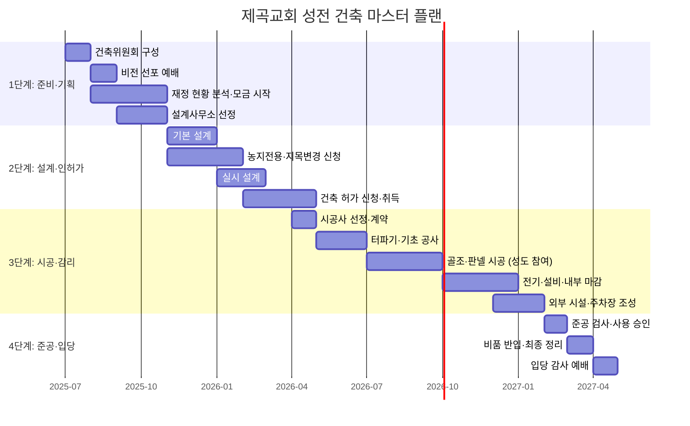

# 제곡교회 성전 건축 준비 계획서 (Part 2)

> 이 문서는 [Part 1](file:///Users/david_lee/.gemini/antigravity/brain/b28f5de3-665e-412b-a2b4-5ae6cf84db39/제곡교회_성전건축_계획서_Part1.md)에 이어지는 후반부입니다.

---

## V. 재정 및 모금 계획

### 1. 총 예상 소요 예산

> [!NOTE]
> 아래 예산은 조립식 판넬 건축 기준의 초기 추정치이며, 실제 설계 후 정밀 견적이 필요합니다. 성도 참여 시공으로 인건비를 절감할 수 있는 항목이 포함되어 있습니다.

#### 건축비 세부 항목

| 구분 | 항목 | 예상 금액 (만원) | 비고 |
|------|------|:---------------:|------|
| **A. 토지 관련** | 기 매입 부지 융자 상환 잔액 | 5,000~8,000 | 현재 상환 진행 중 |
| | 농지전용 부담금 | 500~1,000 | 논 → 대지 전환 비용 |
| | 측량·등기 비용 | 200~300 | 분할·합필 시 추가 |
| **B. 설계·인허가** | 건축 설계비 | 1,000~1,500 | 설계사무소 위탁 |
| | 인허가 수수료 | 100~200 | 건축 허가 관련 |
| | 구조·설비 설계 | 300~500 | 구조 안전, 전기·설비 |
| **C. 시공비** | 조립식 판넬 본체 (100~120평) | 15,000~20,000 | 성도 참여 시 인건비 절감 |
| | 기초·토목 공사 | 3,000~5,000 | 터파기, 기초, 옹벽 등 |
| | 전기·설비 공사 | 2,000~3,000 | 냉난방, 급배수, 전기 |
| | 주차장 조성 | 1,000~1,500 | 아스팔트 또는 투수블록 |
| **D. 인테리어** | 본당 내부 마감 | 2,000~3,000 | 바닥·벽·천장 마감 |
| | 친교실·식당 | 800~1,200 | 주방 설비 포함 |
| | 교육실·목사실 | 500~800 | 기본 마감 |
| **E. 비품·장비** | 의자·강대상·가구 | 800~1,200 | 본당 100~120석 |
| | 음향·영상 장비 | 1,000~1,500 | 동시통역 시스템 포함 |
| | 냉난방 기기 | 500~800 | 산간 지역 고단열 필요 |
| **F. 외부 시설** | 조경·들꽃 정원 | 300~500 | 기도 산책로 포함 |
| | 간판·십자가탑 | 200~400 | 안전한 구조물 |
| | 외부 조명·CCTV | 200~300 | 야간 안전 |
| **G. 예비비** | 예비비 (총액의 10%) | 3,000~5,000 | 물가 상승, 설계 변경 대비 |
| | **총 합계** | **약 37,400 ~ 55,700** | |

#### 예산 목표 요약

| 구분 | 금액 범위 (만원) |
|------|:---------------:|
| **최소 목표** | 약 3억 7,000만 원 |
| **적정 목표** | 약 4억 5,000만 원 |
| **최대 (여유분 포함)** | 약 5억 5,000만 원 |

### 2. 현재 재정 상태 및 부족분 산출

| 항목 | 예상 금액 | 비고 |
|------|-----------|------|
| 건축 기금 적립액 | (교회 확인 필요) | 기존 적립 현황 |
| 부지 매입 융자 잔액 | (교회 확인 필요) | 은행 융자 상환 중 |
| **가용 재원 소계** | **(확인 후 기입)** | |
| 총 필요 예산 | 약 3.7~5.5억 원 | 위 추정치 기준 |
| **부족분** | **(가용 재원 차감 후 산출)** | |

> [!IMPORTANT]
> 정확한 재정 현황은 재정/모금팀이 교회 재정 자료를 확인하여 기입해야 합니다. 이 계획서는 구조와 방향성을 제시하는 문서입니다.

### 3. 단계별·대상별 모금 전략 및 캠페인 실행 일정

#### 전략 1: 내부 모금 — 건축 헌금 약정 캠페인

| 단계 | 시기 | 내용 |
|------|------|------|
| **비전 선포** | 1개월차 | 비전 선포 예배에서 건축 필요성과 비전 공유 |
| **약정 카드 배포** | 2개월차 | 교인 개인·가정별 월 정기 건축 헌금 약정 |
| **특별 건축 헌금** | 수시 | 명절, 기념일 등 특별 감사 헌금 |
| **약정 갱신** | 매년 1회 | 연간 약정 갱신 및 감사 보고 |

#### 전략 2: 동문·관계자 네트워크 활용

- 과거 제곡교회를 거쳐간 성도, 해밀학교 졸업생, 방문 선교팀 등에 **비전 레터** 정기 발송 (분기 1회)
- 미국 집사님 루트를 통한 **해외 교포 교회** 후원 요청
- 일본 파송 선교사 네트워크를 통한 **일본 한인 교회** 후원 연결
- 러시아 선교사 부부 네트워크를 통한 후원 확대

#### 전략 3: 목적형 기부 및 네이밍(Naming) 캠페인

특정 공간이나 비품에 대한 **지정 후원**으로 후원의 구체성과 동기를 높입니다.

| 지정 항목 | 예상 금액 | 네이밍 예시 |
|-----------|-----------|-------------|
| 본당 의자 1석 | 10~20만 원 | 의자 뒷면에 후원자 이름/기도 제목 |
| 어린이부 교육실 | 500~1,000만 원 | "다음 세대의 교실" 명판 |
| 동시통역 부스 | 300~500만 원 | "열방을 품는 창" |
| 주방 설비 | 200~400만 원 | "사랑의 식탁" |
| 가변 벽체 설비 | 150~300만 원 | 후원자 가정 이름 기재 |
| 들꽃 정원 벤치 | 30~50만 원/개 | 벤치에 후원 문구 |
| 음향 장비 일체 | 500~1,000만 원 | "찬양이 울려 퍼지는 곳" |

#### 전략 4: 외부 기관 및 교단 지원금(Grant) 신청

| 대상 | 신청 내용 | 비고 |
|------|-----------|------|
| 소속 교단 | 농어촌 교회 건축 지원금 | 교단별 지원 프로그램 확인 |
| 기독교 재단 | 농어촌 교회 자립 지원 | 한국기독교교회협의회 등 |
| 지자체 보조금 | 복합 문화 공간/요양원 건립 보조금 | 홍천군 관련 사업 검토 |
| 농어촌 지원 사업 | 농어촌 공동체 활성화 지원 | 행안부·농림부 사업 |
| 다문화 관련 지원 | 다문화 가정 지원 시설 보조금 | 여성가족부 사업 |

#### 전략 5: 온라인 크라우드펀딩

- **스토리 기반 캠페인**: "산골교회가 세상을 품습니다" 등 공감을 불러일으키는 스토리텔링
- 기독교 크라우드펀딩 플랫폼 또는 카카오 같이가치 활용
- 정영선 목사의 11년 목회 스토리를 담은 **영상 콘텐츠** 제작
- SNS(유튜브, 인스타그램) 통한 바이럴 마케팅

#### 전략 6: 재능 기부 및 수익 사업

| 행사 | 시기 | 내용 |
|------|------|------|
| **사랑의 바자회** | 연 2회 (봄·가을) | 성도 수공예, 농산물, 음식 판매 + 지역 축제 |
| **한방차·냉커피 팝업 카페** | 여름·겨울 | 정 목사 특제 음료 판매 행사 |
| **다문화 음식 축제** | 연 1회 | 러시아·브라질·미얀마 등 각국 음식 판매 |
| **재능 기부** | 수시 | 건축 기술자, 디자이너, 영상 제작자 등 전문가 봉사 |
| **물품 후원** | 수시 | 조립식 판넬, 건축 자재, 비품 현물 기부 |

#### 모금 캠페인 일정 요약

| 시기 | 캠페인 | 목표 |
|------|--------|------|
| **1~3개월차** | 비전 선포, 내부 약정 시작 | 전체 목표의 30% |
| **4~6개월차** | 네이밍 캠페인, 외부 후원 요청 시작 | 전체 목표의 20% |
| **7~12개월차** | 크라우드펀딩, 교단 지원금 신청, 바자회 | 전체 목표의 30% |
| **13~24개월차** | 지속 모금, 추가 약정 갱신 | 전체 목표의 20% |

### 4. 재정 관리 및 투명성 확보 방안

| 항목 | 실행 방안 |
|------|-----------|
| **전용 계좌 운영** | 건축 기금 전용 계좌 개설, 일반 재정과 완전 분리 |
| **이중 서명제** | 모든 지출은 위원장 + 재정팀장 이중 서명 |
| **월간 재정 보고** | 매월 재정 현황을 전 교인에게 서면·온라인 공개 |
| **분기 외부 감사** | 교단 또는 외부 회계사를 통한 분기별 감사 실시 |
| **영수증 관리** | 모든 거래에 대한 증빙 서류 디지털 아카이빙 |
| **공동의회 승인** | 3,000만 원 이상 지출은 반드시 공동의회 사전 승인 |

---

## VI. 일정 계획 (Master Plan)

### 전체 일정 타임라인 (약 24~30개월)

### 각 단계별 세부 일정

#### 1단계: 준비 및 기획 (약 6개월)

| 월 | 주요 내용 | 담당 |
|----|-----------|------|
| 1개월차 | 건축위원회 구성, 팀별 R&R 확정 | 담임목사, 당회 |
| 2개월차 | 비전 선포 예배, 내부 약정 캠페인 시작 | 기도/영성팀, 재정팀 |
| 2~4개월차 | 재정 현황 분석, 모금 캠페인 본격 가동 | 재정/모금팀 |
| 3~4개월차 | 설계사무소 3곳 이상 비교·선정 | 건축/설계팀 |
| 5~6개월차 | 기본 계획 확정, 네이밍 캠페인 시작 | 전체 위원회 |

#### 2단계: 설계 및 인허가 (약 6개월)

| 월 | 주요 내용 | 담당 |
|----|-----------|------|
| 5~6개월차 | 기본 설계 진행, 교인 의견 수렴 | 건축/설계팀 |
| 5~7개월차 | 농지전용 허가 및 지목 변경 신청 | 기획/행정팀 |
| 7~8개월차 | 실시 설계 완료 | 건축/설계팀 |
| 8~10개월차 | 건축 허가 신청 및 취득 | 기획/행정팀 |

#### 3단계: 시공 및 감리 (약 10~12개월)

| 월 | 주요 내용 | 담당 |
|----|-----------|------|
| 10~11개월차 | 시공사 선정, 계약 체결 | 건축/설계팀, 재정팀 |
| 11~12개월차 | 터파기, 기초 공사 | 건축/설계팀, 시공사 |
| 13~15개월차 | 골조·판넬 시공 (성도 참여 건축) | 건축팀 + 전 교인 |
| 16~18개월차 | 전기·설비·내부 마감 공사 | 시공사, 건축팀 |
| 19~20개월차 | 외부 시설, 주차장, 조경 공사 | 건축팀 |

#### 4단계: 준공 및 입당 (약 2~3개월)

| 월 | 주요 내용 | 담당 |
|----|-----------|------|
| 21개월차 | 준공 검사, 사용 승인 신청 | 기획/행정팀 |
| 22개월차 | 비품 반입, 음향·영상 설치, 최종 점검 | 전체 위원 |
| 23개월차 | **입당 감사 예배** | 전 교인 |

---

## VII. 소통 및 영성 관리 계획

### 1. 전 교인 기도회 및 비전 선포식 일정

| 행사 | 시기 | 내용 |
|------|------|------|
| **비전 선포 예배** | 건축위원회 구성 직후 | 건축 비전 공유, 교인 마음 하나 되기 |
| **릴레이 금식 기도** | 준비 기간 전체 | 매주 지정 가정이 하루씩 금식 기도 |
| **월 1회 건축 기도회** | 매월 첫째 주 수요일 | 건축 진행 보고 + 합심 기도 |
| **정초석(기공식) 예배** | 시공 시작일 | 첫 삽을 뜨며 봉헌 기도 |
| **상량식 예배** | 골조 완성 시 | 건축 현장에서 감사 예배 |
| **입당 감사 예배** | 준공 후 | 새 성전에서 첫 예배, 감사와 헌신 |

### 2. 단계별 진행 상황 공유 채널 (온·오프라인)

#### 오프라인 소통

- **주보 별면**: 매주 건축 진행 현황 및 재정 보고 게재
- **건축 게시판**: 교회 로비에 현장 사진, 일정표, 재정 현황 상시 게시
- **공동의회 보고**: 분기 1회 전체 교인 대상 상세 보고

#### 온라인 소통

- **카카오톡 단체 방**: 실시간 건축 소식, 사진, 기도 제목 공유
- **교회 홈페이지/블로그**: 월간 건축 뉴스레터 게시
- **SNS (인스타그램·유튜브)**: 건축 과정 타임랩스, 성도 참여 모습 영상 공유
- **비전 레터 (이메일/우편)**: 외부 후원자·동문에 분기 1회 발송

### 3. 주변 지역 주민과의 소통 및 민원 대처 방안

| 시기 | 소통 활동 | 담당 |
|------|-----------|------|
| **착공 전** | 주변 주민 사전 설명회 개최, 공사 일정·소음 대책 안내 | 기획/행정팀 |
| **시공 중** | 공사 차량 통행 시간대 조정, 분진·소음 최소화 | 건축/설계팀 |
| **시공 중** | 민원 접수 창구 운영 (위원장 직통 연락처 공개) | 총괄 위원장 |
| **수시** | 마을 어르신 방문, 한방차·냉커피 나눔 (기존 전도 문화 연계) | 담임목사 |
| **완공 후** | 마을 초청 행사, 교회 시설 공유 (문화 행사, 모임 공간 제공) | 소통/홍보팀 |

---

## VIII. 기대 효과 및 향후 비전

### 1. 건축 완공 후 지역 사회와 공동체에 미칠 긍정적 영향

#### 교회 공동체에 미치는 영향

- **합법적 예배 공간 확보**: 벌금 부과 해소, 안전한 구조물에서 안심하고 예배
- **다세대 통합 사역 강화**: 어린이·청소년·청년·장년·어르신이 각자의 공간에서 성장
- **다문화 사역 확대**: 동시통역 환경 완비로 글로벌 공동체 사역 본격화
- **선교 허브 기능**: 국내외 선교사 훈련 및 파송 거점

#### 지역 사회에 미치는 영향

- **농어촌 교회 자립 모델 제시**: 전국 농어촌 교회에 희망과 도전을 전달
- **지역 복합 문화 공간**: 마을 모임, 문화 행사, 교육 프로그램의 거점
- **고령자 돌봄 인프라**: 9인 소규모 요양원 운영으로 어르신 복지 기여
- **다문화 커뮤니티 지원**: 외국인 노동자, 다문화 가정 지원 거점
- **교통 환경 개선**: 불법 주차 해소로 마을 도로 정상화

### 2. 새로운 공간에서의 사역 확장 계획

#### 단기 사역 (입당 후 1~2년)

| 사역 | 내용 |
|------|------|
| **안정화 예배** | 새 공간에서의 예배 안착, 음향·영상 시스템 최적화 |
| **교육 프로그램 확대** | 어린이 성경 통독, 청소년 세계관 학교, 성인 제자훈련 강화 |
| **지역 교회 네트워크** | 주변 농어촌 교회 초청, 연합 예배·세미나 개최 |

#### 중기 사역 (입당 후 3~5년)

| 사역 | 내용 |
|------|------|
| **9인 소규모 요양원** | 현 건물을 리모델링하여 어르신 공동생활 공간 운영 |
| **다문화 선교 센터** | 외국인 노동자 대상 한국어 교육, 생활 지원, 복음 전파 |
| **농어촌 교회 컨퍼런스** | 자립·성장 노하우를 나누는 연례 컨퍼런스 개최 |
| **선교사 파송 확대** | 2호, 3호 선교사 양성 및 파송 |

#### 장기 사역 (입당 후 5~10년)

| 사역 | 내용 |
|------|------|
| **지역 복음화 운동** | 남면 전체를 대상으로 한 체계적 전도·봉사 사역 |
| **글로벌 선교 네트워크** | 러시아·일본·브라질·미얀마·몽골 등 연결된 국가 선교 네트워크 |
| **다음 세대 리더 배출** | 통독·훈련으로 성장한 청년들이 교회와 사회의 리더로 성장 |
| **산골 교회 희망 캠페인** | "산골교회도 할 수 있다" 메시지를 전국에 전파 |

---

## 부록

### A. 제곡교회 약사 (略史)

| 연도 | 주요 사건 |
|------|-----------|
| 1983 | 제곡교회 설립, 1대 목사 부임, 조립식 판넬 교회 건축 |
| 1983~2013 | 4명의 목회자 사역 (목회자 잦은 교체) |
| 2013 | 정영선 목사 5대 담임 부임 (당시 교인 약 20명, 평균 연령 70대) |
| 2013~2016 | 꿈꾸는 여행, 1:1 제자훈련, 기도학교, 교회 정비 |
| 2016~2018 | 예배 변화 (반주기 → 찬양 인도), 동네 전도 본격화 |
| 2018~ | 젊은 가정 유입, 교회학교 부흥, 평균 연령 급락 |
| 2019~ | 다문화 성도 유입 (러시아·브라질·미얀마 등) |
| 2020~2021 | 코로나 시대 가정예배 훈련, 줌 예배, 공동체 성숙 |
| 2022~ | 해외 선교팀 방문, 영어 성경학교, 선교사 파송 |
| 2024 | 부지 매입, 건축 기금 모금 시작 |
| 2025 | 건축위원회 구성, 건축 준비 본격화 |

### B. 참고 성경 말씀

> **"여호와여 내가 주께서 계시는 집과 주의 영광이 머무는 곳을 사랑하오니"** — 시편 26:8
>
> **"은도 내 것이요 금도 내 것이니라 만군의 여호와의 말이니라 이 성전의 나중 영광이 이전 영광보다 크리라 만군의 여호와의 말이니라 내가 이 곳에 평강을 주리라 만군의 여호와의 말이니라"** — 학개 2:8-9
>
> **"지혜로 집을 세우고 명철로 그것을 굳게 하나니"** — 잠언 24:3

---

> **"산골의 작은 교회이지만 주님의 기쁨인 교회가 되어, 이 어려운 시대에 작은 울림이 되는 교회가 되겠습니다."**
>
> — 정영선 목사

---

*본 계획서는 제곡교회 건축위원회의 내부 검토 및 공동의회 승인을 거쳐 확정됩니다.*
*문의: 제곡교회 (강원도 홍천군 남면 제곡리 274-5)*
